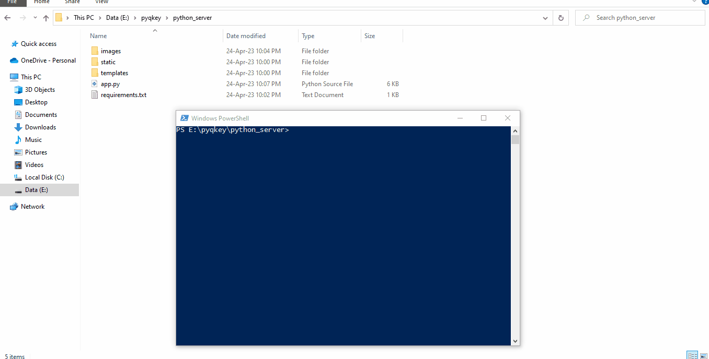

### :dart: Aim

This project aims to develop a key delivery system for QKD(Quantum key distribution) system using HTTPS REST API as per ETSI standard.

# **Follow the steps as below:**


#### 1. Python Dependencies

Run command below in the path containing `app.py` file.

```shell
pip install -r python_server/requirements.txt
```


#### 2. Generating SSL Certificate

Run command below in the path containing `app.py` file.

```shell
openssl req -x509 -newkey rsa:4096 -nodes -out cert.pem -keyout key.pem -days 365
```


**Tutorial:**




#### 3. Define environment variables

```
PYQKEY_FLASK_SEC_KEY
PYQKEY_KME_ID
PYQKEY_MONGO_COLL
PYQKEY_MONGO_DB
PYQKEY_MONGO_DOMAIN
PYQKEY_MONGO_PASSWD
PYQKEY_MONGO_PORT
PYQKEY_MONGO_USER
```


**Tutorial:**


<p style="color:red;"><b>After defining the environment variables you must restart the system.</b></p>


#### 4. Launching app

 `cmd `  or  `powershell`as administrator to run the server.

```
python app.py
```


Output will be something like below:

```
 * Serving Flask app 'app' (lazy loading)
 * Environment: production
   WARNING: This is a development server. Do not use it in a production deployment.
   Use a production WSGI server instead.
 * Debug mode: on
WARNING: This is a development server. Do not use it in a production deployment. Use a production WSGI server instead.
 * Running on all addresses (0.0.0.0)
 * Running on https://127.0.0.1:443
```

Use the address as shown by the output to access the webpage. for eg.`https://127.0.0.1:443`

---


# MongoDB Setup


1. #### **Installation:**

---

**MongoDB Windows**: https://fastdl.mongodb.org/windows/mongodb-windows-x86_64-4.4.19-signed.msi

**Install with default options**. It will also install **mongodb compass** in case it doesn't then use the link below to download and install **mongodb compass**. 

**MongoDB compass** https://downloads.mongodb.com/compass/mongodb-compass-1.36.4-win32-x64.exe

---


2. #### Connecting to Database using Mongodb Compass

   ---

   

   By default **domain** is **localhost** and **port** is **27017**. 

   Hence default URI is **mongodb://localhost:27017**. Click on connect button to connect.

   ---

   

3. #### Creating the Database and Collection

   ---

   

   ---


Set environment variables as shown in **Step 3**:

<p style="color:red;"><b>
! Below values are just for illustration purpose, use values as per your own requirements !
</b></p>

​	PYQKEY_FLASK_SEC_KEY 	 =  some_secret
​	PYQKEY_KME_ID				    = 123
​	PYQKEY_MONGO_COLL       =  keys
​	PYQKEY_MONGO_DB           =  pyqkey
​	PYQKEY_MONGO_DOMAIN = localhost 
​	PYQKEY_MONGO_PASSWD = admin
​	PYQKEY_MONGO_PORT       = 27017
​	PYQKEY_MONGO_USER       =  admin

---


# Demo

- #### Using browser:


- #### Using curl:

  

  ```bash
  curl -k  -s https://localhost:443/api/v1/keys/123/status
  ```

  

  

  

  ```bash
  curl -k  -s https://localhost:443/api/v1/keys/123/enc_keys
  ```

  

